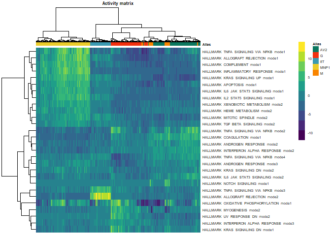
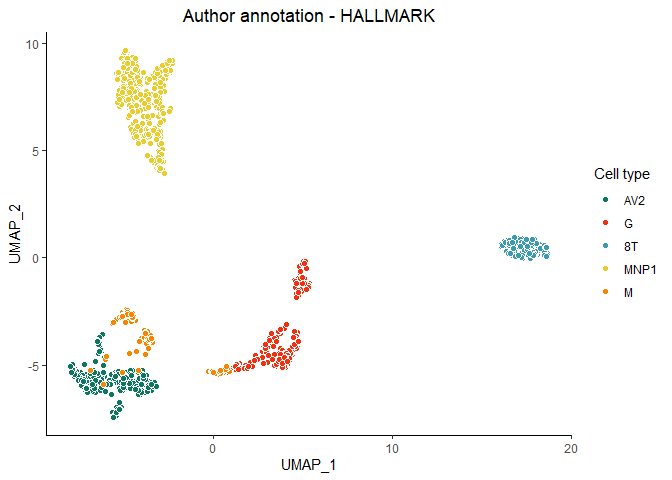
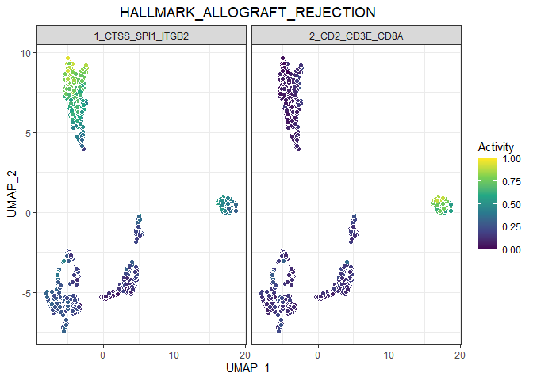
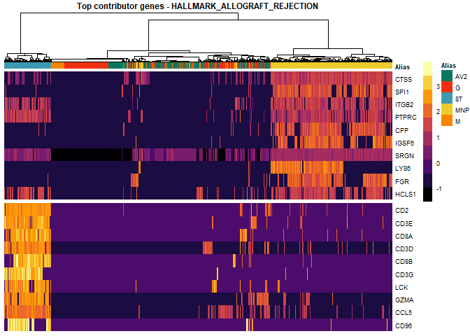
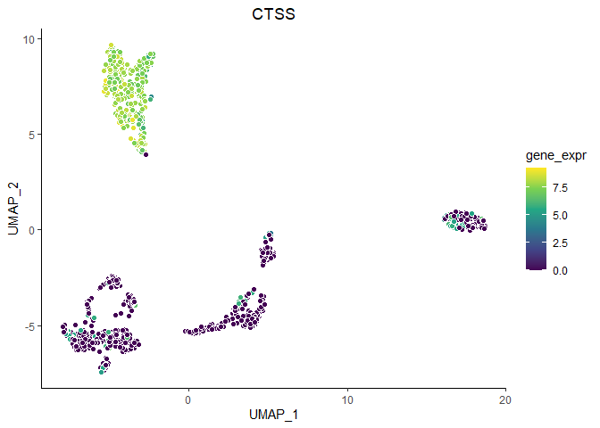
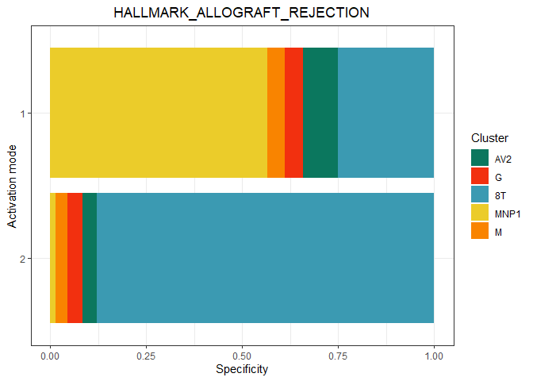
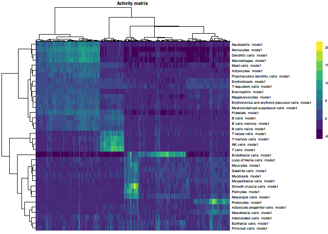
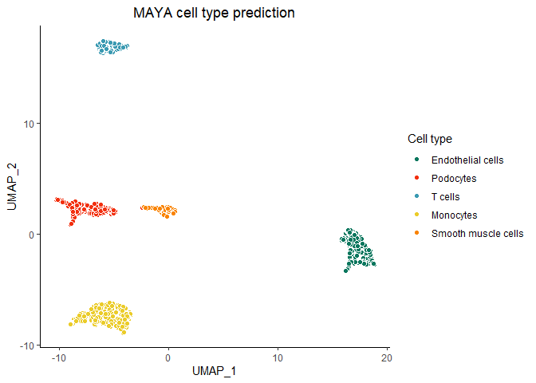
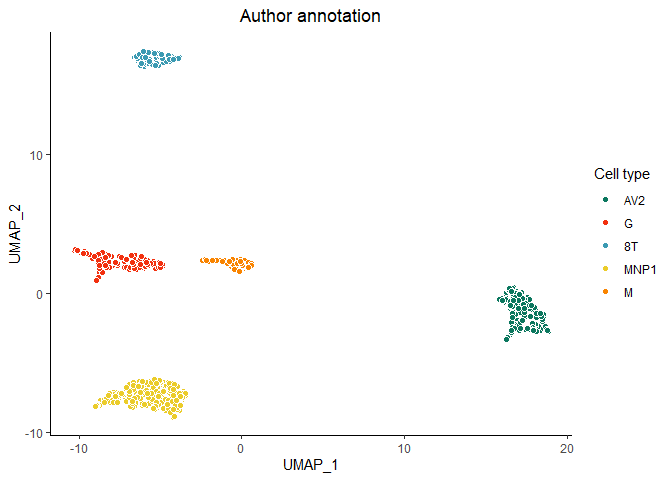
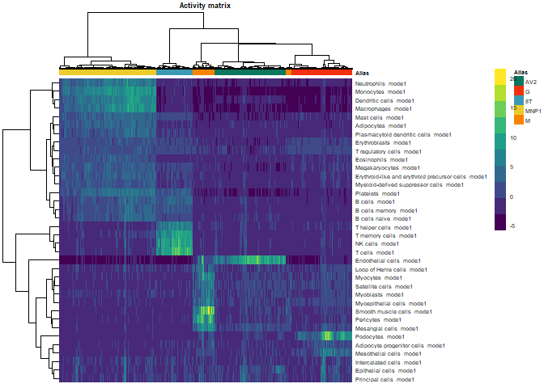

# Introduction

MAYA (Multimodes of pathwAY Activation) enables comprehensive pathway study and automated cell type prediction thanks to multimodal activity scoring of gene lists (pathways from MSigDB or markers from PanglaoDB for instance) in individual cells.

MAYA provides functions to build a multimodal pathway activity matrix, compute UMAP to visualize cells in 2 dimensions based on this activity matrix, visualize the different modes of activation of a pathway in this space and also check the expression of top contributing genes of each mode in the dataset through heatmaps.

MAYA also provides a function to predict cell type based on PanglaoDB or any custom cell type markers list provided by the user. Cells can also be visualized in embeddings computed based on the marker activity matrix. MAYA is not run in a multimodal way for cell type prediction for interpretability purposes. 


# Installation

This package requires R >= 4.0.5 to run and can be installed using devtools:


```r
install.packages("devtools")
devtools::install_github("one-biosciences/maya")
```

# Use case: kidney dataset

Through this use case, we will demonstrate the insight that brings multimodal pathway activity analysis to apprehend the cellular heterogeneity of a dataset. We will show how to use the different functions available in this package to run a full analysis of the activity of MSigDB HALLMARK gene sets in normal kidney cells.
We will also demonstrate how to use the integrated MAYA function to automatically predict cell types.

This example dataset was built using a count matrix and corresponding metadata made available by *Young et al.(2018)*. In their paper, the authors thoroughly investigated the cellular identity of normal and cancerous human kidneys from 72,501 single-cell transcriptomes, which led to the identification of various cell types and subtypes of normal and cancerous immune and non-immune cell types.

The matrix was filtered to select only protein coding genes and keep only 5 groups of **normal** cells:  

* **AV2** (Vascular endothelium – ascending vasa recta)
* **G** (Glomerular epithelium - podocytes)
* **M** (Mesangial cells - myofibroblasts)
* **8T** (CD8 T cells)
* **MNP1** (Mononuclear phagocytes)


## Loading data


```r
library(MAYA)
```


First, load the example count matrix available in the package:

```r
path<-system.file("extdata", "kidney_count_matrix.tsv", package = "MAYA")
count_mat<-Matrix::Matrix(as.matrix(read.table(file=path,sep="\t",header=T,check.names = F)),sparse=TRUE)
dim(count_mat)
```

```
## [1] 19720  1252
```
The number of cells was intentionally chosen small to ensure reasonable running time for this example. 

Then, load the associated metadata:

```r
path<-system.file("extdata", "kidney_metadata.tsv", package = "MAYA")
meta<-read.table(file=path,sep="\t",header=T)
dim(meta)
```

```
## [1] 1252    5
```

```r
colnames(meta)
```

```
## [1] "nCount_RNA"   "nFeature_RNA" "Alias"        "Cell_type1"   "Cell_type2"
```
We have several variables available to characterize our cells:

* "nCount_RNA" (number of molecules counted)
* "nFeature_RNA" (number of genes expressed)
* "Alias" (short cell subtype name)
* "Cell_type1" (cell type description)
* "Cell_type2" (cell subtype description)

"Alias" is the annotation that will be preferred to describe our cells as it corresponds to the annotation of the 5 groups described above.


```r
table(meta$Alias)
```

```
## 
##   8T  AV2    G    M MNP1 
##  155  305  259  118  415
```

## Running MAYA_pathway_analysis

The user simply needs a raw count matrix and to specify in *modules_list* either "hallmark" or "kegg" to load prebuilt versions of the corresponding MSigDB pathway lists, or provide any list of pathways with their associated markers (they can be loaded from gmt files with the function MAYA::read_gmt).


```r
activity_summary<-MAYA_pathway_analysis(expr_mat=count_mat,
                                        modules_list = "hallmark",
                                        is_logcpm=F)
```

```
## Running pathway analysis
```

```
## Loading HALLMARK from MSigDB
```

```
## Computing gene sets activity
```

```
## Found at least one informative activation mode for 20 gene sets
```

The result is a list containing the main fields:

* activity_matrix: mode by cell matrix
* umap: activity-based embeddings for result exploration
* PCA_obj: detailed result of activity analysis by pathway, required for some plotting functions

The user can then visualize the activity matrix as a heatmap:


```r
plot_heatmap_activity_mat(activity_mat = activity_summary$activity_matrix, 
                          meta = meta, 
                          annot_name = "Alias")
```

<!-- -->

The user can also choose to scale each mode between 0 and 1, which sometimes help homogenize the visualization when some modes have high activation compared with others.

```r
plot_heatmap_activity_mat(activity_mat = scale_0_1(activity_summary$activity_matrix), 
                          meta = meta, 
                          annot_name = "Alias")
```

<!-- -->

The user can also check how cells from different cell types organize in MAYA embeddings based on hallmark pathways activity:


```r
plot_umap_annot(umap=activity_summary$umap,
                labels = meta$Alias,
                title = "Author annotation - HALLMARK")
```

<!-- -->

The user can then visualize multimodal activity of a specific pathway on the UMAP - the allograft rejection for instance - and check the expression of top 10 contributing genes for each mode. For this purpose, the user might want to plot the logCPM counts and therefore normalize the matrix at this stage.


```r
plot_umap_pathway_activity(umap=activity_summary$umap,
                           PCA_object = activity_summary$PCA_obj,
                           module = "HALLMARK_ALLOGRAFT_REJECTION")
```

<!-- -->


```r
logcpm<-logcpmNormalization(count_mat)
plot_heatmap_pathway_top_contrib_genes(expr_mat=logcpm,
                                       PCA_object = activity_summary$PCA_obj,
                                       module = "HALLMARK_ALLOGRAFT_REJECTION",
                                       n = 10,
                                       meta = meta,
                                       annot_name = "Alias")
```

<!-- -->

The expression of top contributing genes can also be plotted on the UMAP.


```r
plot_umap_gene(umap=activity_summary$umap,
               expr_mat = logcpm,
               gene = "CTSS")
```

<!-- -->

Finally, the user can compute and represent the specificity of each mode in the different cell types.


```r
plot_pathway_specificity(PCA_object = activity_summary$PCA_obj,
                         module = "HALLMARK_ALLOGRAFT_REJECTION",
                         meta = meta,
                         annot_name = "Alias")
```

<!-- -->


## Running MAYA_predict_cell_type

To run the cell type prediction module in the simplest way, one only needs a raw count matrix, and the algorithm will load the full PanglaoDB to try to identify cell types.
However some parameters might be important to have in mind like *min_cells_pct* which corresponds to the minimal fraction of cells you expect a cell type to represent in the whole dataset (default is 5%), *organs* to directly specify the tissue you are working on to avoid possible interferences between similar cell types located in different organs, *is_logcpm* that should be set to true if one already performed a custom data normalization, *nCores* to speed up the process if possible and *compute_umap* to disable this option that can take more time as the size of the dataset increases.


```r
# activity_summary<-MAYA_predict_cell_types(expr_mat = count_mat)
activity_summary<-MAYA_predict_cell_types(expr_mat = count_mat,
                                    min_cells_pct = 0.05,
                                    organs = "Kidney",
                                    is_logcpm = FALSE,
                                    nCores = 1,
                                    compute_umap = T)
```

```
## Running cell type identification
```

```
## Loading PanglaoDB
```

```
## Computing gene sets activity
```

```
## Found at least one informative activation mode for 36 gene sets
```

```
## Computing UMAP on activity matrix
```

<!-- -->

The result is a list containing the main fields:

* cell_annotation: vector with cell type for each cell or "unassigned"
* activity_matrix: mode by cell matrix
* umap: activity-based embeddings for result exploration

The user can visualize cell annotation in MAYA embeddings, compare it with the authors annotation and visualize the underlying activity matrix.


```r
plot_umap_annot(umap=activity_summary$umap,
                labels = activity_summary$cell_annotation,
                title = "MAYA cell type prediction")
```

<!-- -->


```r
plot_umap_annot(activity_summary$umap,labels = meta$Alias,title = "Author annotation")
```

<!-- -->


```r
plot_heatmap_activity_mat(activity_mat = activity_summary$activity_matrix, 
                          meta = meta, 
                          annot_name = "Alias")
```

<!-- -->


```r
sessionInfo()
```

```
## R version 4.0.5 (2021-03-31)
## Platform: x86_64-w64-mingw32/x64 (64-bit)
## Running under: Windows 10 x64 (build 19044)
## 
## Matrix products: default
## 
## locale:
## [1] LC_COLLATE=French_France.1252  LC_CTYPE=French_France.1252   
## [3] LC_MONETARY=French_France.1252 LC_NUMERIC=C                  
## [5] LC_TIME=French_France.1252    
## 
## attached base packages:
## [1] parallel  stats     graphics  grDevices utils     datasets  methods  
## [8] base     
## 
## other attached packages:
##  [1] MAYA_0.1.0             leidenbase_0.1.3       viridis_0.5.1         
##  [4] viridisLite_0.4.0      wesanderson_0.3.6.9000 pheatmap_1.0.12       
##  [7] RANN_2.6.1             igraph_1.2.6           umap_0.2.7.0          
## [10] ggplot2_3.3.5          dplyr_1.0.5            Matrix_1.2-18         
## 
## loaded via a namespace (and not attached):
##  [1] reticulate_1.18    tidyselect_1.1.2   xfun_0.31          bslib_0.3.1       
##  [5] purrr_0.3.4        lattice_0.20-41    colorspace_2.0-0   vctrs_0.3.8       
##  [9] generics_0.1.2     htmltools_0.5.2    yaml_2.2.1         utf8_1.2.1        
## [13] rlang_1.0.1        jquerylib_0.1.4    pillar_1.7.0       glue_1.6.2        
## [17] withr_2.4.3        DBI_1.1.1          RColorBrewer_1.1-2 lifecycle_1.0.1   
## [21] stringr_1.4.0      munsell_0.5.0      gtable_0.3.0       evaluate_0.15     
## [25] labeling_0.4.2     knitr_1.39         fastmap_1.1.0      fansi_0.4.2       
## [29] highr_0.8          Rcpp_1.0.7         openssl_1.4.3      scales_1.1.1      
## [33] jsonlite_1.7.2     farver_2.1.0       RSpectra_0.16-0    gridExtra_2.3     
## [37] askpass_1.1        digest_0.6.27      stringi_1.5.3      grid_4.0.5        
## [41] cli_3.2.0          tools_4.0.5        magrittr_2.0.1     sass_0.4.0        
## [45] tibble_3.1.0       crayon_1.5.0       pkgconfig_2.0.3    ellipsis_0.3.2    
## [49] assertthat_0.2.1   rmarkdown_2.7      rstudioapi_0.13    R6_2.5.1          
## [53] compiler_4.0.5
```


 
